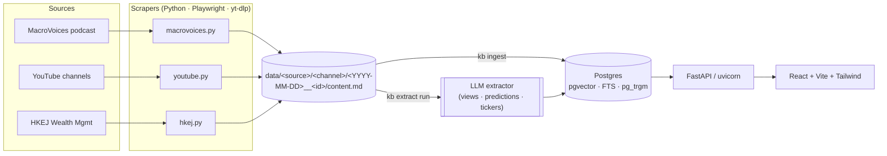

# Knowledge Base

Personal investment knowledge base. Scrapes podcasts, YouTube channels, and HKEJ
columnists into markdown, extracts structured views/predictions with an LLM,
and serves a search + leaderboard webapp.

## Architecture




### Data layout on disk

```
data/
  macrovoices/<episode_slug>/{episode.md, slides.pdf, raw.html}
  youtube/<channel_handle>/<YYYY-MM-DD>__<video_id>/{transcript.md, info.json}
  hkej/<author_slug>/<YYYY-MM-DD>__<article_id>/{article.md, raw.html}
```

`data/**` is git-ignored (only structure committed). The DB is the source of
truth for search; the markdown files are the canonical raw content.

## Quick start

```pwsh
cd knowledge_base
copy .env.example .env   # fill in your secrets
uv sync
uv run playwright install chromium

docker compose up -d postgres
uv run kb db migrate

# scrape (each runs as its own job; safe in parallel)
uv run kb scrape youtube  --limit 5
uv run kb scrape macrovoices --limit 3
uv run kb scrape hkej --limit 20

# extract structure
uv run kb extract run --limit 50
uv run kb leaderboard rebuild

# serve api + frontend
uv run kb api
cd frontend && npm install && npm run dev
```

See `AGENTS.md` for design notes and conventions.
