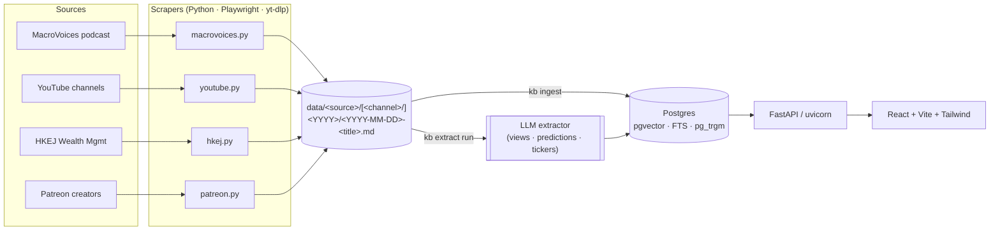

# Knowledge Base

Personal investment knowledge base. Scrapes podcasts, YouTube channels, HKEJ
columnists, and Patreon creators into markdown, extracts structured
views/predictions with an LLM, and serves a search + leaderboard webapp.

## Architecture




### Data layout on disk

```
data/
  hkej/<author>/<YYYY>/<YYYY-MM-DD>-<title>.md        # content
  raw/hkej/<author>/<YYYY>/<YYYY-MM-DD>-<title>.html  # raw HTML

  macrovoices/<YYYY>/<YYYY-MM-DD>-<ep_id>-<title>.md
  raw/macrovoices/<YYYY>/<YYYY-MM-DD>-<ep_id>-<title>.html  [.slides.pdf …]

  youtube/<channel>/<YYYY>/<YYYY-MM-DD>-<title>.md

    patreon/<channel>/<YYYY>/<YYYY-MM-DD>-<title>.md
    raw/patreon/<channel>/<YYYY>/<YYYY-MM-DD>-<title>.html
```

Content files carry YAML front-matter (`source`, `channel`, `external_id`,
`url`, `published_at`, `title`, …). Raw HTML and supplementary files live
under `data/raw/` mirroring the same path structure.

`data/**` is git-ignored (only structure committed). The DB is the source of
truth for search; the markdown files are the canonical raw content.

To migrate an existing checkout to the current layout:
```pwsh
uv run python scripts/migrate_data_layout.py   # safe to re-run; no-ops on already-flat files
uv run kb ingest                                # re-index DB with new paths
```

## Quick start

```pwsh
cd knowledge_base
copy .env.example .env   # fill in your secrets
uv sync
uv run playwright install chromium

docker compose up -d postgres
uv run kb db migrate

# scrape (each runs as its own job; safe in parallel)
uv run kb youtube scrape --limit 5
uv run kb scrape run macrovoices --limit 3
uv run kb scrape run hkej --limit 20
uv run kb patreon scrape <creator> --limit 3

# extract structure
uv run kb extract run --limit 50
uv run kb leaderboard rebuild

# serve api + frontend
uv run kb api
cd frontend && npm install && npm run dev
```

See `AGENTS.md` for design notes and conventions.
